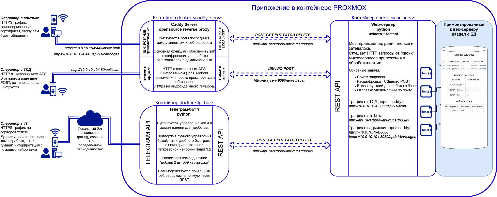

# CartridgeMaster - python приложение для учёта картриджей.
Приложение будет использоваться для:
* учёта количества картриджей
* учёта еженедельного расхода
* прогнозов на будущие расходы из анализа истории.

Логически разделено на 2 модуля:
- Телеграм бот.
- Локальный веб-сервер, для обмена данными с приложением CartridgeScanner.

Информация о используемых версиях и зависимостях в файле requirements.txt  

## База данных
Используется локальная БД SQLite - database.db. Хранится в корне, в директории вместе с main.py.   
Состоит из таблиц cartridges, barcodes, users.  

Таблица cartridges. Связана с barcodes связью один ко многим:
| id | cartridge_name | quantity |     last_update      |
|----|----------------|----------|----------------------|
| 1  | Имя_картриджа_1 |     5   | 2026-02-18 14:03:43  |
| 2  | Имя_картриджа_2 |     2   | 2026-02-18 14:03:44  |  

Таблица barcodes. Столбец cartridge_id ссылается на первичный ключ id из первой таблицы cartridges.
| barcode | cartridge_id |
|----------------|---|
| 4004764390564  | 1 |
| 1234567891121  | 1 |
| 1234567891111  | 2 |

Таблица users. id в этой таблица просто уникальный порядковый номер.
| id | telegram_id | first_name |  notice_enable    |
|----|-------------|------------|-------------------|
| 1  |  123123123  |   User     |        1          |

## Бот на телеграм
Бот написан с использованием фреймворка aiogram, работает в асинхроне.

Диспетчер бота регистрирует и обрабатывает все события, получаемые от серверов телеграма.

## Веб-сервер и обмен c ТСД (Терминал сбора данных)
HTTP-сервер написан на aiohttp, работает в том же процессе, что и бот.
Работает по адресу http://local_ip:8080/scan принимает и обрабатывает json через POST-запросы, формируемые приложением CartridgeScanner.

## CartridgeScanner
Приложение CartridgeScanner устанавливается на Android устройство со встроенным сканером (тестилось на Android версии 9)
* Обмен данными осуществляется POST запросами к серваку - пока реализовано только добавление или уменьшение количества картриджей.
* Поскольку сырой http трафик передается в незашифрованном виде, перед тем как отправить POST, ТСД шифрует отправляемое json-сообщение алгоритмом AES. Аналогично, принятый ответ от сервера сначала расшифровывается.
* Ключ шифрования AES_KEY зашит в коде на серверной части и ТСД-шнике, но надо придумать что-то понадежнее.

## Что поменять? 
Архитектура слишком завязана на телеграм, сейчас "админ-панель" это команды, отправляемые тг-боту. 

План на новую версию, сервисы будут зависеть только от работы веб-сервера:
* Нужен обратный прокси caddy server(в докере caddy_serv), чтобы он сам обновлял сертификаты и защищал соединение.
* Веб-сервер (в докере api_serv) обрабатывает запросы, дёграет базу и шлет уведомления по почте.
* ТГ-бот (в докере tg_bot) взаимодействует напрямую с web-сервером через его REST API. Там же крутится нейронка Llama-3.2 (когда нейронка думает она грузит проц, на практике скорее всего в этот момент будет подвисать база)
* Оставляем взаимодействие ТСД с веб-сервером только через шифрованный POST.
* Веб-клиенты пользуются админ-панелью на html + js + ajax. index.html может отдавать caddy, а обработку в js (ajax) отправлять в api_serv.
* Взять какой нибудь токен с API для Qwen, и скидывать ему логи расходов на анализ. Для прогнозов на будущие заказы.

Можно поставить локальную легковесную нейронку Llama-3.2-1B-Instruct-Q8_0.gguf
установить в виртуальное окружение собранный бинарник python wheel (эта для винды)
И парсить json с помощью неё

pip install https://github.com/abetlen/llama-cpp-python/releases/download/v0.3.2/llama_cpp_python-0.3.2-cp311-cp311-win_amd64.whl

Лучше взять эту, правильнее реагирует на излишние слова:
[https://huggingface.co/hugging-quants/Llama-3.2-1B-Instruct-Q4_K_M-GGUF/tree/main](https://huggingface.co/hugging-quants/Llama-3.2-1B-Instruct-Q4_K_M-GGUF)

Для тестов используется питоновское виртуальное окружение 3.11

Ссылка на скачивание лок моделей:
https://huggingface.co/hugging-quants/models

## ЗАМЕТКИ
1. Сделать удаление штрих-кодов /delbar BARCODE ID, но так, чтобы нельзя было удалить последни
2. Сделать добавление штрих-кодов /addbar BACODE ID
3. Вывод истории в телегу /showhistory START_DATE END_DATE. Лучше будет, чтобы тг бот формировал txt
4. Попробовать уже развернуть в докере на proxmox, примонтировать файл базы
