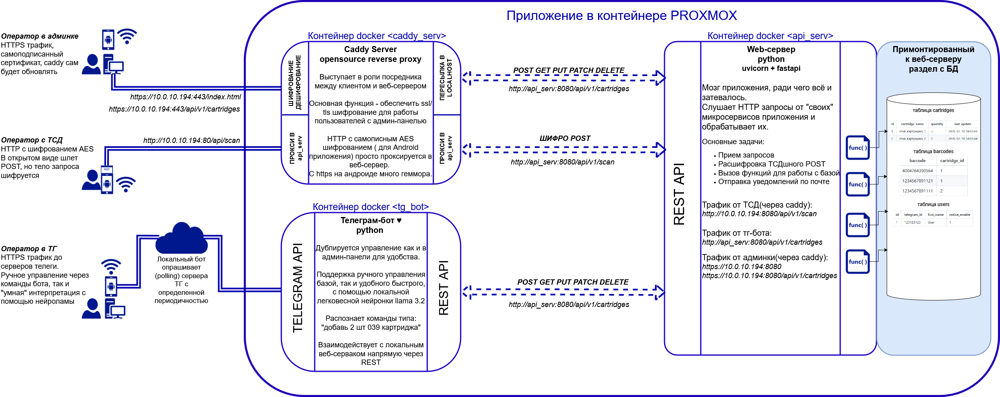

# Cartridge Scanner - клиентская часть на ТСД
Приложение Cartridge Scanner устанавливается на Android устройство со встроенным сканером (тестилось на Android версии 9)
* Обмен данными осуществляется POST-запросами к серваку - только добавление или уменьшение количества картриджей.
* Поскольку сырой http трафик передается в незашифрованном виде, перед тем как отправить POST, ТСД шифрует отправляемое json-сообщение алгоритмом AES. Аналогично, принятый ответ от сервера сначала расшифровывается.
* Ключ шифрования AES_KEY зашит в коде на серверной части и ТСД-шнике, но надо придумать что-то понадежнее.
# Cartridge Master - серверная часть, веб-приложение для учёта картриджей.
Приложение состоит из 2 компонент: 
* Uvicorn-Web-Server
* Caddy-Reverse-Proxy
### Caddy
* Обеспечивает пересылку HTTPS трафика (443 порт) на HTTP (8080) бэкенда.
* Блокирует входящий HTTP трафик
* Пропускает только шифрованные POST-запросы от ТСД
### Веб-сервер на Uvicorn
Веб-сервер работает на 8080 порту. 

Используется легковесный фреймворк FastAPI для быстрого создания эндпоинтов.   

### База данных
Используется локальная БД SQLite - database.db. Хранится в корне, в директории вместе с main.py.   
Состоит из таблиц cartridges, barcodes, users.  

Таблица cartridges. Связана с barcodes связью один ко многим:
| id | cartridge_name | quantity |     last_update      |
|----|----------------|----------|----------------------|
| 1  | Имя_картриджа_1 |     5   | 2026-02-18 14:03:43  |
| 2  | Имя_картриджа_2 |     2   | 2026-02-18 14:03:44  |  

Таблица barcodes. Столбец cartridge_id ссылается на первичный ключ id из первой таблицы cartridges.
| barcode | cartridge_id |
|----------------|---|
| 4004764390564  | 1 |
| 1234567891121  | 1 |
| 1234567891111  | 2 |

Таблица users. id в этой таблица просто уникальный порядковый номер.
| id | telegram_id | first_name |  notice_enable    |
|----|-------------|------------|-------------------|
| 1  |  123123123  |   User     |        1          |

# Диаграмма

